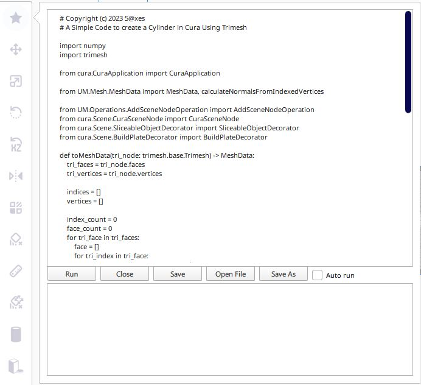

# CuraLiveScriptingPlugin

Cura Live scripting Plugin

## Run
  Run the script
### Auto run
  Auto execute the Script 

## Close
  Close The Windows open on a Force Mode.
  
## Save
  Save the Script ( Defaut path : live_script.py)
  
### Defaut path
  `[Cura configuration folder]/plugins/CuraLiveScripting`.

The configuration folder can be found via **Help** -> **Show Configuration Folder** inside Cura.

This menu opens the following folder:
* Windows: `%APPDATA%\cura\<Cura version>\`, (usually `C:\Users\<your username>\AppData\Roaming\cura\<Cura version>\plugins\CuraLiveScripting\CuraLiveScripting\scripts\live_script.py`)
* Mac OS: `$HOME/Library/Application Support/cura/<Cura version>/plugins/CuraLiveScripting/CuraLiveScripting/scripts/live_script.py`
* Linux: `$HOME/.local/share/cura/<Cura version>/plugins/CuraLiveScripting/CuraLiveScripting/scripts/live_script.py`

## OpenFile

Open an existing script File.

